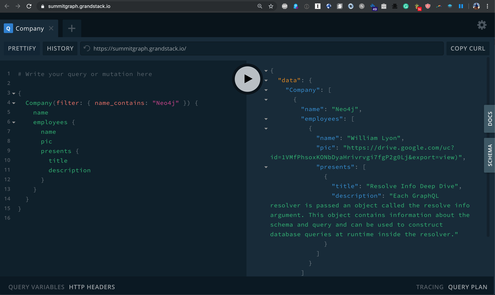

[](https://deploy.now.sh/?repo=https://github.com/johnymontana/graphql-summit-graph&env=NEO4J_USER&env=NEO4J_URI&env=NEO4J_PASSWORD)

# GraphQL Summit Graph

[GraphQL Summit](https://summit.graphql.com/) is the world's largest conference dedicated to GraphQL. This repo contains a simple demo [GRANDstack](https://grandstack.io) app to explore the conference sessions and show personalized recommendations using:

**GRANDstack**

* GraphQL
* React
* Apollo
* Neo4j Database

Follow these steps to get the GraphQL Summit Graph up and running:

1. [Download Neo4j and import the schedule data](https://github.com/johnymontana/graphql-summit-graph#neo4j)
2. [Run the Node.js GraphQL API app using neo4j-graphql.js](https://github.com/johnymontana/graphql-summit-graph#graphql-api)
3. [Query the GraphQL Summit Graph using GraphQL Playground!](https://github.com/johnymontana/graphql-summit-graph#query-using-graphql-playground)


## Neo4j


The data for the app is stored in Neo4j graph database. You can [download Neo4j Desktop locally](https://neo4j.com/download/) or [spin up a blank Neo4j Sandbox.](https://neo4j.com/sandbox-v2/)

To import the GraphQL Summit schedule data into Neo4j, run this query in Neo4j Browser by copy/pasting it in the query editor in Neo4j Browser;

```Cypher
LOAD CSV WITH HEADERS FROM "https://raw.githubusercontent.com/johnymontana/graphql-summit-graph/master/data/summit_schedule.csv" AS row 

MERGE (s:Session {title: row.title})
SET 
  s.date     = datetime({epochMillis: apoc.date.parse(row.date, 'ms', 'MM/dd/yyyy HH:mm a')}),
  s.level    = row.audience,
  s.format   = row.format,
  s.abstract = row.abstract,
  s.title    = row.title

MERGE (sp:Speaker {name: row.name})
SET
  sp.twitter = row.twitter,
  sp.github  = row.github,
  sp.website = row.website,
  sp.image   = coalesce(row.image, row.headshot)

MERGE (sp)-[:PRESENTS]->(s)

MERGE (cp:Company {name: row.organization})
MERGE (cp)<-[wf:WORKS_FOR]-(sp)
SET wf.role = row.role

MERGE (th:Theme {name: row.theme})
MERGE (th)<-[:HAS_THEME]-(s)

MERGE (r:Room {name: row.track})
MERGE (r)<-[:IN_ROOM]-(s)
```


## GraphQL API


A GraphQL API fetches data from Neo4j using the [`neo4j-graphql.js`](https://grandstack.io/docs/neo4j-graphql-js.html)

*Install dependencies*

```
cd api
npm install)
```

*Add Neo4j credentials to .env*

Edit the `.env` file, adding the connection credentials for your Neo4j database:

```
TODO: .env example
```

TODO: annotated sandbox screenshot

*Start API server*
```
npm start
```

## Query Using GraphQL Playground



Navigate to `http://localhost:4001` in a web browser to load GraphQL Playground, an interactive tool to query our GraphQL endpoint.

Here are some interesting GraphQL queries you can try:


```GraphQL
TODO: insert interesting GraphQL queries
```

